# Mayday — Architecture

```mermaid
flowchart TB
    subgraph Cloud["Qwen Cloud"]
        QWEN["qwen-max (OpenAI-compatible)"]
    end

    subgraph Alibaba["Alibaba Cloud (deploy target)"]
        ECS["ECS — patient + agents"]
        RDS["ApsaraDB RDS (Postgres)<br/>app_settings · incidents · trust · case_files"]
        OSS["OSS — report uploads"]
    end

    subgraph Patient["Patient — Laravel CRM console"]
        PAGES["/dashboard · /admin/users · /admin/orders<br/>/admin/report · /admin/users/&#123;id&#125;/edit"]
        HEALTH["/health · /_watch/targets · /_auth/ping"]
        INJ["Fault injector (5 config + 3 code)<br/>corrupts REAL state; ledger is grade-only"]
    end

    subgraph Society["Agent society (Python)"]
        WATCH["Watchman — patrols, opens/closes incidents, MTTR"]
        COORD["Coordinator — state machine"]
        DISP["Dispatcher — brief + trust-weighted auction"]
        INVA["Investigator A — logs/config tools"]
        INVB["Investigator B — metrics/db tools"]
        ADJ["Adjudicator (code) — trials each fix vs real health"]
        VERIF["Verifier — apply · re-check · rollback / human gate"]
        TRUST["Trust store — per-agent, per-category"]
        MEM["Case-file memory — recall similar incidents"]
    end

    subgraph Tools["MCP tool layer"]
        T["log.search · metrics.query · config.read · db.inspect<br/>healthcheck.run · recent_errors · code.read/patch · runbook.rag"]
    end

    WAR["War Room — live SSE console<br/>siren · debate bubbles · trust bars · approval modal"]

    WATCH -->|patrol| HEALTH
    WATCH -->|incident| COORD
    COORD --> DISP --> INVA & INVB
    INVA <-->|debate: staked evidence| INVB
    INVA & INVB --> ADJ --> VERIF
    VERIF --> TRUST
    VERIF --> MEM
    MEM -.recall.-> DISP
    DISP & INVA & INVB & ADJ & VERIF --> QWEN
    INVA & INVB & ADJ & VERIF --> T
    T --> PAGES & HEALTH & INJ
    VERIF -->|fix.apply| RDS
    Patient --> RDS
    Patient --> OSS
    COORD -->|structured events| WAR
    WAR -->|iframe / status| Patient
```

## Flow (one incident)

1. **Watchman** patrols the console every 5s; two consecutive failures on a watched
   page open an **incident** (records the log byte-offset so evidence is scoped to
   this incident only).
2. **Dispatcher** recalls similar past **case files**, writes a brief, and runs the
   **trust-weighted auction** (`bid = self-assessed fit × historical trust`).
3. **Investigator A & B** (different tool subsets) gather live evidence and stake a
   root-cause hypothesis with a confidence stake.
4. They **debate** — each attacks the other citing tool-derived evidence, then holds
   or revises. Runbooks may inform, but a hypothesis must cite live evidence.
5. **Adjudicator** (deterministic, no LLM) **trials each proposed fix** against the
   real health checks — apply → healthcheck → revert — and picks what actually works.
6. **Verifier** commits the winner: config fixes auto-apply; source-code fixes pause
   for **human approval**; it re-checks the whole system and rolls back if not green.
7. **Trust** settles into the winning agent's category; a **case file** is written so
   the next incident of that kind resolves faster (the learning curve).
8. Every step streams as a structured event into the **War Room**.

## Model & data

- **Qwen** everywhere: local Ollama `qwen2.5` for dev, **`qwen-max` on Qwen Cloud**
  for the real proof (single `LLM_PROVIDER` switch; OpenAI-compatible client).
- **Alibaba Cloud** in prod: ECS hosts the patient + agents; **ApsaraDB RDS**
  (Postgres) holds `app_settings`, incidents, trust scores, and case files; **OSS**
  receives report uploads. The MCP `fix.apply` writes the same real config store the
  patient reads — exactly as in prod.
